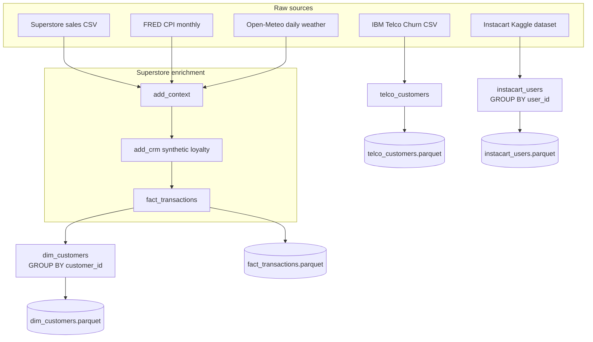

# LoyaltySim-AI — Data Pipeline Reference

This document explains how raw data becomes modeling-ready datasets: what each file contains, the **grain** (one row = what?), how tables are joined, and which fields are real vs synthetic.

**Entry point:** `scripts/build_datasets.py`  
**Walkthrough:** `Notebooks/data_prep.ipynb` (same logic; Steps 6–8 import these scripts)  
**Outputs:** `data/modeling/*.parquet`

---

## 1. Big picture

LoyaltySim-AI builds **four independent modeling universes**:

| Dataset | Based on | Linked to Superstore? |
|---------|----------|------------------------|
| `fact_transactions` | US Superstore sales | — (core fact table) |
| `dim_customers` | Aggregated from `fact_transactions` | Yes (`customer_id`) |
| `telco_customers` | IBM Telco Churn | **No** — different customers |
| `instacart_users` | Instacart orders (Kaggle) | **No** — different customers |

Only Superstore-derived tables share a `customer_id`. Telco and Instacart are **standalone benchmarks** for churn and basket/reorder models; they are never joined to the loyalty retail spine.



---

## 2. Pipeline steps (in execution order)

### Step 0 — Download and cache raw files

Raw files are saved under `data/raw/` so re-runs are fast.

| Source | URL / origin | Cached path |
|--------|----------------|-------------|
| Superstore | GitHub (`ThigasSantos/BaseSuperStore`) | `data/raw/us_superstore/superstore_sales.csv` |
| US macro | FRED (`CPIAUCSL`, `UNRATE`, `FEDFUNDS`, 2016–2019) | `data/raw/external/us_macro_monthly.csv` |
| Weather | Open-Meteo geocoding + archive API | `data/raw/external/us_weather_by_city.csv` |
| Telco | IBM Telco Churn repo | `data/raw/us_telco/telco_customer_churn.csv` |
| Instacart | Kaggle (`yasserh/instacart-...`) | `data/raw/instacart/*.csv` |

**Superstore cleaning (on first download):**

- Column names normalized to `snake_case` (e.g. `CustomerID` → `customer_id`).
- Dates parsed (`order_date`, `ship_date`).
- **US-only filter:** `country == "United States"`.
- Result: **9,994 rows** (order line items), **~5,009 unique orders**, **4 regions** (South, West, East, Central).

**Macro fallback:** If FRED is unreachable, a flat CPI placeholder (`240.0`) is used for every month; unemployment and interest rate are left null. YoY inflation is omitted when prior-year CPI is unavailable.

**Instacart:** Requires `~/.kaggle/kaggle.json`. If missing, Instacart is skipped; the other three outputs still build.

---

### Step 1 — `build_fact_transactions()`

```
Superstore
  → assign transaction_id (txn_0000000, txn_0000001, …)
  → add_context (holidays, calendar, macro, weather)
  → add_crm (synthetic loyalty attributes)
  → fact_transactions
```

This is the **central fact table** for loyalty retail modeling.

---

### Step 2 — `build_dim_customers(fact)`

```
fact_transactions
  → GROUP BY customer_id
  → dim_customers
```

One row per Superstore customer with rollups (orders, revenue, recency, loyalty fields).

---

### Step 3 — `build_telco_customers()` (standalone)

Downloads IBM Telco CSV, renames `customerID` → `telco_customer_id`, coerces `TotalCharges` to numeric, adds binary `churn_flag`. **No join to Superstore.**

---

### Step 4 — `build_instacart_users()` (standalone, optional)

Reads Instacart `orders.csv`, aggregates to **one row per `user_id`**. **No join to Superstore.**

---

## 3. Join rules and grain

### 3.1 `fact_transactions` — grain: **one row = one order line item**

A single `order_id` can appear on **multiple rows** (different products).  
`transaction_id` is unique per row (row index in the enriched Superstore frame).

| Join | Left key | Right key | Type | What it adds |
|------|----------|-----------|------|--------------|
| Macro | `month` (from `order_date`) | `month` | LEFT | `cpi_index`, `inflation_mom`, `inflation_yoy`, `unemployment_rate`, `interest_rate` |
| Weather | `date` + `city` + `state` | `date` + `city` + `state` | LEFT | `temp_c`, `rain_mm`, `snow_cm`, `precip_mm`, `weather_code`, `wind_gust_kmh`, `had_rain`, `had_snow`, `had_major_storm` |
| CRM (synthetic) | `customer_id` | `customer_id` | LEFT | tier, points, opt-in, scores |

**Calendar features** are computed in-process (not joined from a table):

- `is_us_federal_holiday` — US federal holidays 2015–2019 via `holidays` library
- `day_of_week` — 0=Monday … 6=Sunday
- `is_us_payday_window` — order day is 1st or 15th of month

**Weather:** One coordinate per Superstore **city + state** (geocoded via Open-Meteo), not regional proxies.

Daily weather for 2016-01-01 → 2019-12-31 is joined to every transaction on **order date** + **city** + **state**.

Storm flags use WMO weather codes (heavy rain, snow, thunderstorms) and wind gusts ≥ 75 km/h.

---

### 3.2 `dim_customers` — grain: **one row = one customer**

Built only from `fact_transactions` via `groupby("customer_id")`.

| Aggregation | Logic |
|-------------|--------|
| `customer_name`, `segment`, `tier`, CRM fields | `first` (constant per customer) |
| `home_region` | `first` on `region` |
| `first_order_date` / `last_order_date` | `min` / `max` of `order_date` |
| `total_orders` | `nunique(order_id)` |
| `total_sales` / `total_profit` | `sum` |
| `avg_discount` | `mean` |
| `avg_order_value` | `total_sales / total_orders` |

**Relationship:** `dim_customers.customer_id` ←→ `fact_transactions.customer_id` (1:N).

---

### 3.3 `telco_customers` — grain: **one row = one telco account**

~7,043 customers from IBM’s public churn dataset.  
**No `customer_id` shared with Superstore.** Use this table alone for classical telecom churn (XGBoost/LightGBM).

---

### 3.4 `instacart_users` — grain: **one row = one Instacart user**

~206k users aggregated from order history.  
**No link to Superstore `customer_id`.** Use for basket/reorder or sequence-style models.

---

## 4. Column dictionaries

### 4.1 `fact_transactions.parquet`

**Identifiers & order**

| Column | Type | Description |
|--------|------|-------------|
| `transaction_id` | string | Unique line-item ID (`txn_0000000`, …) |
| `order_id` | string | Superstore order ID (multiple lines per order) |
| `order_date` | datetime | When the order was placed |
| `ship_date` | datetime | When the order shipped |
| `ship_mode` | string | Shipping class (e.g. Second Class, Standard Class) |

**Customer & geography**

| Column | Type | Description |
|--------|------|-------------|
| `customer_id` | string | Superstore customer ID (e.g. `CG-12520`) |
| `customer_name` | string | Customer display name |
| `segment` | string | Consumer / Corporate / Home Office |
| `country` | string | Always `United States` after filtering |
| `city` | string | Ship-to city |
| `state` | string | US state |
| `postal_code` | float | ZIP code |
| `region` | string | South, West, East, or Central |

**Product & economics**

| Column | Type | Description |
|--------|------|-------------|
| `product_id` | string | Superstore product SKU |
| `category` | string | Furniture, Office Supplies, Technology |
| `sub_category` | string | Finer product grouping |
| `product_name` | string | Full product label |
| `sales` | float | Line revenue ($) |
| `quantity` | int | Units on this line |
| `discount` | float | Discount rate (0–1) on this line |
| `profit` | float | Line profit ($) |

**Temporal context (derived)**

| Column | Type | Description |
|--------|------|-------------|
| `date` | date | `order_date` normalized to midnight (join key for weather) |
| `month` | string | `YYYY-MM` period string (join key for CPI) |
| `is_us_federal_holiday` | bool | True if order date is a US federal holiday |
| `day_of_week` | int | 0=Mon … 6=Sun |
| `is_us_payday_window` | bool | True if order day is 1 or 15 |

**Macro context (FRED)**

| Column | Type | Description |
|--------|------|-------------|
| `cpi_index` | float | Consumer Price Index level for order month |
| `inflation_mom` | float | Month-over-month CPI % change |
| `inflation_yoy` | float | Year-over-year CPI % change (requires prior-year CPI in download) |
| `unemployment_rate` | float | US unemployment rate % (`UNRATE`) |
| `interest_rate` | float | Federal funds effective rate % (`FEDFUNDS`) |

**Weather context (Open-Meteo, by city)**

| Column | Type | Description |
|--------|------|-------------|
| `temp_c` | float | Mean daily temperature (°C) for ship-to city on order date |
| `rain_mm` | float | Daily rain (mm) |
| `snow_cm` | float | Daily snowfall (cm) |
| `precip_mm` | float | Total daily precipitation (mm) |
| `weather_code` | int | WMO weather code (most severe condition that day) |
| `wind_gust_kmh` | float | Max wind gust (km/h) |
| `had_rain` | bool | True if `rain_mm` > 0 |
| `had_snow` | bool | True if `snow_cm` > 0 |
| `had_major_storm` | bool | Heavy rain/snow/thunderstorm code or wind gust ≥ 75 km/h |

**Synthetic loyalty CRM** (`add_crm`, seed=42)

| Column | Type | Description |
|--------|------|-------------|
| `tier` | string | Bronze / Silver / Gold / Platinum (weighted 45/30/20/5%) |
| `points_balance` | int | Random 100–7,999 per customer |
| `email_opt_in` | bool | ~72% True |
| `app_usage_score` | float | 0–1 engagement proxy |
| `discount_sensitivity` | float | 0–1 propensity to respond to discounts |

> **Note:** CRM fields are **random but fixed per `customer_id`** — the same customer has the same tier/points on every transaction row.

**Source extras:** The raw Superstore file may include columns like `OrderYear` and `Order Quarter` that are not renamed or dropped by the pipeline; they pass through if present.

---

### 4.2 `dim_customers.parquet`

| Column | Type | Description |
|--------|------|-------------|
| `customer_id` | string | Primary key; matches `fact_transactions` |
| `customer_name` | string | From first transaction |
| `segment` | string | Consumer / Corporate / Home Office |
| `home_region` | string | Region from first transaction |
| `first_order_date` | datetime | Earliest `order_date` |
| `last_order_date` | datetime | Latest `order_date` |
| `total_orders` | int | Distinct `order_id` count |
| `total_sales` | float | Sum of line `sales` |
| `total_profit` | float | Sum of line `profit` |
| `avg_discount` | float | Mean line discount |
| `avg_order_value` | float | `total_sales / total_orders` |
| `tier` | string | Synthetic loyalty tier |
| `points_balance` | int | Synthetic points |
| `email_opt_in` | bool | Synthetic marketing consent |
| `app_usage_score` | float | Synthetic app engagement |
| `discount_sensitivity` | float | Synthetic discount responsiveness |

**Typical use:** RFM, inactivity churn, CLV features, next-best-action at customer level.

---

### 4.3 `telco_customers.parquet`

Standalone IBM Telco Churn schema (column names mostly unchanged except below).

| Column | Notes |
|--------|--------|
| `telco_customer_id` | Renamed from `customerID` |
| `gender`, `SeniorCitizen`, `Partner`, `Dependents` | Demographics |
| `tenure` | Months as customer |
| `PhoneService`, `MultipleLines` | Phone product flags |
| `InternetService` | DSL / Fiber / No |
| `OnlineSecurity`, `OnlineBackup`, `DeviceProtection`, `TechSupport` | Add-on services |
| `StreamingTV`, `StreamingMovies` | Streaming add-ons |
| `Contract` | Month-to-month / One year / Two year |
| `PaperlessBilling`, `PaymentMethod` | Billing preferences |
| `MonthlyCharges` | Current monthly bill ($) |
| `TotalCharges` | Lifetime charges ($); coerced numeric, some missing → NaN |
| `Churn` | Original label: `Yes` / `No` |
| `churn_flag` | **Target:** 1 = churned, 0 = stayed |

**Typical use:** Supervised churn classification with a real labeled target.

---

### 4.4 `instacart_users.parquet` (optional)

| Column | Type | Description |
|--------|------|-------------|
| `user_id` | int | Instacart user identifier |
| `total_orders` | int | Count of orders in `orders.csv` |
| `avg_days_since_prior` | float | Mean gap between consecutive orders |
| `reorder_rate` | float | Share of orders where `days_since_prior_order` is not null (proxy for repeat behavior) |

**Typical use:** Reorder prediction, cohort analysis, sequence models. Requires Kaggle download.

---

## 5. What is real vs synthetic?

| Layer | Source | Real? |
|-------|--------|-------|
| Superstore transactions | Public retail dataset | **Real** (sample/anonymized) |
| US holidays | `holidays` library | **Deterministic** from calendar |
| CPI / inflation | FRED (or flat fallback) | **Real** (or placeholder) |
| Weather | Open-Meteo archive | **Real** at city level (geocoded) |
| Loyalty CRM (tier, points, …) | `numpy` RNG, seed=42 | **Fully synthetic** |
| Telco | IBM public dataset | **Real** (anonymized) |
| Instacart | Kaggle public dataset | **Real** (anonymized) |

The loyalty CRM exists so you can simulate campaigns, tiers, and uplift **without** a real CRM export. Treat those fields as **plausible stand-ins**, not ground truth.

---

## 6. Temporal and geographic scope

| Aspect | Scope |
|--------|--------|
| Superstore orders | 2016–2019 (US only) |
| CPI | Monthly, 2016-01 → 2019-12 |
| Weather | Daily, 2016-01-01 → 2019-12-31, by city + state |
| Holidays | US federal, years 2015–2019 checked |
| Telco | Snapshot dataset (no transaction dates) |
| Instacart | Separate time range from source Kaggle files |

Align time-based features in models to **order_date** on the Superstore spine.

---

## 7. Entity relationships (Superstore spine only)

```
dim_customers (1) ──────< fact_transactions (N)
     customer_id              customer_id

Within fact_transactions:
  order_id (1) ──────< multiple line items (N)
  customer_id (1) ───< CRM attributes repeated on each row
  month (N) ─────────> us_macro_monthly (1 row per month)
  date + city + state (N) ─> us_weather_by_city (1 row per day per city)
```

**Not connected:**

```
telco_customers.telco_customer_id  ≠  fact_transactions.customer_id
instacart_users.user_id            ≠  fact_transactions.customer_id
```

---

## 8. Which dataset for which model?

| Modeling goal | Primary table | Grain | Key columns |
|---------------|---------------|-------|-------------|
| Transaction CLV / seasonality | `fact_transactions` | Line item | `sales`, `profit`, `order_date`, context features |
| Customer segmentation / RFM | `dim_customers` | Customer | `total_orders`, `total_sales`, recency dates |
| Inactivity churn | `dim_customers` | Customer | `last_order_date`, `total_orders` |
| Loyalty simulation / uplift | `fact_transactions` or `dim_customers` | Either | Synthetic `tier`, `points_balance`, `discount_sensitivity` |
| Telecom churn (labeled) | `telco_customers` | Account | `churn_flag`, tenure, charges, services |
| Grocery reorder / baskets | `instacart_users` | User | `total_orders`, `reorder_rate` |

---

## 9. Reproduce the pipeline

```powershell
pip install -r requirements.txt
python scripts/build_datasets.py
```

Or step-by-step in `Notebooks/data_prep.ipynb`.

**Expected output sizes (approximate):**

| File | Rows |
|------|------|
| `fact_transactions.parquet` | 9,994 |
| `dim_customers.parquet` | ~793 |
| `telco_customers.parquet` | ~7,043 |
| `instacart_users.parquet` | ~206k (if Kaggle configured) |

---

## 10. Design choices (why it’s built this way)

1. **Superstore as spine** — Rich transaction + product + geo data in one public dataset; small enough to iterate quickly.
2. **Context enrichment** — Holidays, macro, and weather make time-series and uplift experiments more realistic without proprietary data.
3. **Synthetic CRM** — Fills the “loyalty program” gap so campaign simulation and tier-based policies can be prototyped.
4. **Separate Telco / Instacart** — Provides **real labeled churn** and **large-scale basket behavior** without forcing artificial joins across incompatible customer IDs.
5. **LEFT joins everywhere** — No transactions dropped if macro or weather is missing for a key; missing context becomes NaN rather than row loss.

---

## 11. Quick reference — one-line grains

| Dataset | Grain |
|---------|--------|
| `fact_transactions` | One row = one product line on one order |
| `dim_customers` | One row = one Superstore customer |
| `telco_customers` | One row = one telco subscriber account |
| `instacart_users` | One row = one Instacart shopper |
